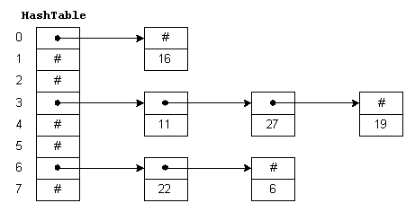

# PROO 3 - Assignment: _Hashed_ Music Library

## Objective
Create a _hash table_ for storing songs and podcast episodes.

## Things To Learn
* The inner workings of a _hash table_.
* The _Factory_ pattern.
* Parsing dates.
* Working with (wrapped) exceptions.
* Reading from files.
* Working with linked lists.

## Submission Guidelines
* Via Github Classroom following the assignment acceptance criteria.

## Coding Guidelines
* Package name (of the root package): at.htlleonding.newsagency
* Each source file shall have a file header denoting the application, assignment number, author
* Each class shall have a short API compliant documentation stating its purpose and important things to know.

## Task



In this assignment you need to implement a _hash table_ for storing music tracks inside the class `MusicLibrary`:

* Our _hash table_ will be a combination of an array and linked lists: Each _bucket_ is represented by a `Node` (i.e. the _head_).
* We will be overriding the `Track`'s `hashCode` method to determine the appropriate bucket. For our simple solution we'll just add up the _ASCII_-values of the characters in a track's artist and title `String`s.
* When adding a `Track` to our music library, we calculate the _hash code_ and perform a _modulo_ operation using the count of _buckets_ - take a look at the figure above for easier understanding. We then append the track to the list in the appropriate _bucket_ - or set it as _head_ if it's empty.
    * The _equality_ of two tracks is given, if they have the same title and artist. Make sure to not add duplicates to the _hash table_!
* We do the same when looking for track: We calculate the _hash code_ using the same approach and the values (i.e. the _artist_ and the _title_) to determine the _bucket_. Next we iterate the linked list to look for the desired track.

For creating the tracks we'll be using a simple variation of the _Factory-pattern_ by implementing the static `createFromString` method in the `TrackFactory` class. The method should determine the type (`Track` or `PodcastTrack`) by the length of the passed `String`. If an exception happens during the parsing of the lines, make sure to wrap it inside a `MusicLibraryException` before passing it on!

Both unit tests as well as a main class are provided. Start with the former to make sure you understand all the implementation details - you should then be able to produce the output as demonstrated below using the latter.

## Hints
### Padding With Zeroes
You can use the following `String.format`-syntax to add leading zeroes to an integer if necessary:

```
String.format("%03d", 7); //007 
String.format("%03d", 13); //013
```

### Parsing Dates
Use the `LocalDate`-class when working with dates in _Java_. In combination with a `DateTimeFormatter` you can define exact patterns for parsing. E.g. the pattern `EEE, d MMM yyyy HH:mm:ss Z` would work on dates like `Mon, 23 Aug 2021 05:00:00 +0200`.

```
DateTimeFormatter dateTimeFormatter = DateTimeFormatter.
    ofPattern("EEE, d MMM yyyy HH:mm:ss Z", Locale.ENGLISH);
LocalDate date = LocalDate.parse(dateRaw, dateTimeFormatter);
```

### Getting _ASCII_ Values From A `String`
You can use the following combination of `charAt` and a _cast_ to get the _ASCII_ values of a `String`:

```
int asciiValue = (int)"Java".charAt(1); //97    
```

## Output Example
```
Bucket 0:
	ORF Ö1 - Die Levante, Teil 3 4:52 (Ö1 Betrifft: Geschichte) 2021-10-20 Description: Der östliche Mittelmeerraum Die Levan...
	ORF Ö1 - Die Donau, Teil 2 4:51 (Ö1 Betrifft: Geschichte) 2021-10-12 Description: Vom Schwarzwald bis zum Schwarzen Mee...
	ORF Ö1 - Aufklärung Habsburger, Teil 5 4:52 (Ö1 Betrifft: Geschichte) 2021-9-17 Description: Aufklärung Habsburger, Teil 5Der Weg ...
	ORF Ö1 - Auf den historischen Spuren des Klimawandels, Teil 1 4:52 (Ö1 Betrifft: Geschichte) 2021-8-23 Description: Wie der Mensch seit Jahrtausenden mit...
	ORF Ö1 - Frauenwohnungslosigkeit ++ Hans Zollner ++ Klimaallianz 4:48 (Ö1 Religion aktuell) 2021-10-19 Description: 
	ORF Ö1 - Armutskonferenz   ++   Jonischkeit 4:47 (Ö1 Religion aktuell) 2021-10-15 Description: 
	Texta - Wo?Hin! ft. Lylit 6:13 (grotesk) 2011
	Texta - Kein Problem ft. Nikitaman 4:11 (Paroli) 2007
	Texta - Zeit 4:12 (Paroli) 2007
	Texta - Es bahnt sich an 4:24 (So oder so) 2004
	Texta - Verdächtig 4:25 (Blickwinkel) 2002
Bucket 1:
	Texta - Attitüde 3:31 (Mehr oder Weniger) 2021
	Texta - Oba Wie 3:33 (grotesk) 2011
	Texta - Ka Genie 4:05 (grotesk) 2011
	Texta - Heaven 4:18 (grotesk) 2011
	Texta - Koida Kaffee Rmx ft. Markee, Kayo, BauXL & GC 7:51 (So oder so) 2004
	Texta - Freiheit 4:38 (gegenüber) 1999
	Texta - HipHop Gedanken II 4:21 (gediegen) 1997
Bucket 2:
	ORF Ö1 - Die Donau, Teil 4 4:52 (Ö1 Betrifft: Geschichte) 2021-10-14 Description: Vom Schwarzwald bis zum Schwarzen Mee...
	ORF Ö1 - Die Donau , Teil 3 4:50 (Ö1 Betrifft: Geschichte) 2021-10-13 Description: Vom Schwarzwald bis zum Schwarzen Mee...
	ORF Ö1 - Auf den historischen Spuren des Klimawandels, Teil 3 4:51 (Ö1 Betrifft: Geschichte) 2021-8-25 Description: Wie der Mensch seit Jahrtausenden mit...
	Texta - Strange 4:13 (grotesk) 2011
	Texta - Jugend ohne Kopf ft. Average 4:24 (Paroli) 2007
	Texta - Nur die Liebe zaehlt 4:13 (So oder so) 2004
	Texta - So oder so 3:58 (So oder so) 2004
	Texta - Worlds ft. Click da Supahlatin, Tariq & Akil of Jurassic 5 5:03 (gegenüber) 1999
	Texta - Millionen Personen 4:06 (gediegen) 1997
	Texta - Lebe in den Tag 4:05 (gediegen) 1997
	Texta - Bonus Track: so gut wie ich funkmix 4:40 (gediegen) 1997
```
...
```
Bucket 30:
	ORF Ö1 - Die Levante, Teil 2 4:51 (Ö1 Betrifft: Geschichte) 2021-10-19 Description: Der östliche Mittelmeerraum Die Levan...
	ORF Ö1 - Die Donau, Teil 1 4:52 (Ö1 Betrifft: Geschichte) 2021-10-11 Description: Vom Schwarzwald bis zum Schwarzen Mee...
	ORF Ö1 - Aufklärung Habsburger, Teil 4 4:52 (Ö1 Betrifft: Geschichte) 2021-9-16 Description: Aufklärung Habsburger, Teil 4Erzählt ...
	Texta - Das Game 3:21 (Nichts dagegen, aber) 2016
	Texta - So könnt's gehen 3:49 (Paroli) 2007
	Texta - Ups & Downs ft. Wenzel Washington 4:42 (Paroli) 2007
	Texta - Geben & Nehmen 4:21 (So oder so) 2004
	Texta - Fernweh ft. Sektion Kuchikäschtli 4:55 (So oder so) 2004
	Texta - Soul Interlude I 2:37 (Blickwinkel) 2002
	Texta - Es ist nicht einfach 4:28 (gediegen) 1997
Largest bucket size: 11 
Average bucket size: 5.65 
Found song "Mein Baby" in bucket 23 at position 1.
Found episode "Geschiche des Burgenlandes - Teil 3" in bucket 10 at position 0.
```